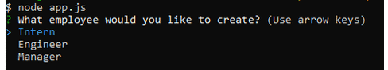
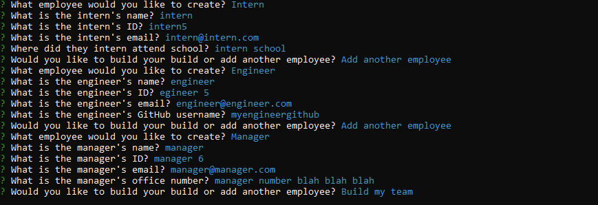
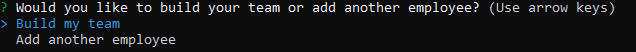

# Template Engine - Employee Summary

## Table of Contents

* [Installation](#installation)
* [Summary](#summary)
* [Usage](#usage)
* [History](#history)
* [Credits](#credits)
* [License](#license)

## Installation

* Download my files in its entirety.
* Using your terminal, navigate to the "develop" folder on your desktop.
* Use command "node app.js" in your terminal without the quotations.

## Summary

This program asks the user a series of questions then takes the answers and generates a html file with list of employees.

Main menu:

Answered questions
⬇️⬇️⬇️

Once user has completed adding all the employees, they will use the option to "Build my team"
⬇️⬇️⬇️

then a html file is created with the list of employees
⬇️⬇️⬇️

## Usage

* This is strictly for educational purposes.

## History

https://github.com/johnnylieu/Template-Engine---Employee-Summary/commits/master

## Credits

* gifmaker.org
* I want to thank my tutor Bobbi Tarkany for helping me with the finishing touches.

## License
 
* © 2019 Trilogy Education Services, a 2U, Inc. brand. All Rights Reserved.
* © UCSD Coding Bootcamp
